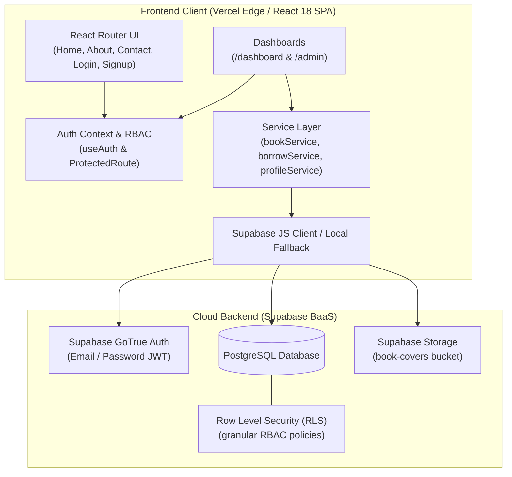
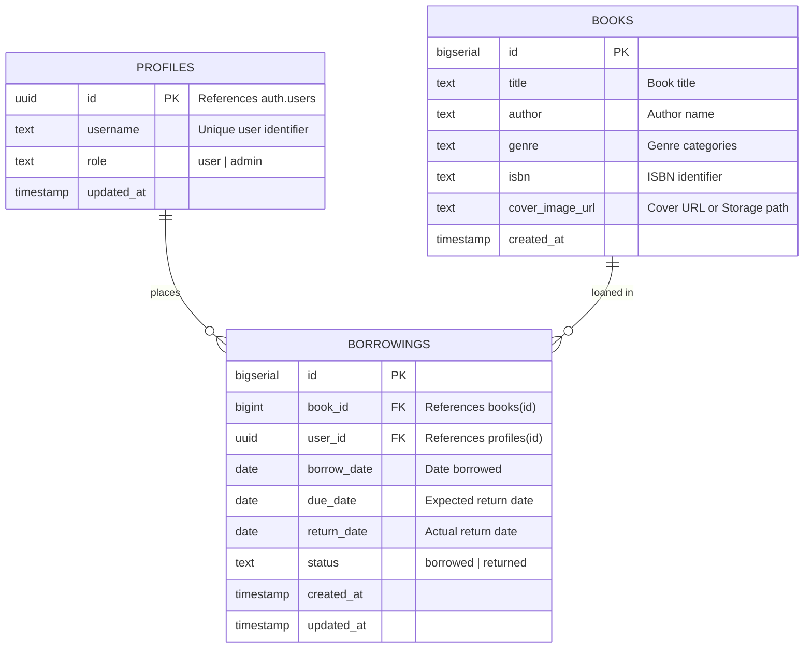

# 📚 Digital Library Platform

A production-ready, full-stack digital library management web application migrated from legacy vanilla scripts to **React 18**, **Vite**, **React Router v7**, and **Supabase** (PostgreSQL, Authentication, Row-Level Security, and Cloud Storage).

Hosted on **Vercel** with automated continuous integration via **GitHub Actions**.

---

## 🏛️ System Architecture



---

## 🚀 Key Features

* **Modern Single Page Application (SPA)**: Built with React 18 and Vite for blazing-fast Hot Module Replacement (HMR) and sub-2-second production builds.
* **Role-Based Access Control (RBAC)**: Client-side route protection via `<ProtectedRoute>` ensuring `/admin` is restricted to authorized administrators and `/dashboard` is accessible to authenticated users.
* **Concurrency-Safe Book Borrowing**: PostgreSQL partial unique index (`unique_active_book_borrowing`) guarantees that two users can never simultaneously borrow the same book.
* **Robust Error Handling & Loading States**: Dismissible Bootstrap notification banners (`AlertBanner`) and inline button loaders (`Saving...`, `Borrowing...`, `Returning...`, `Removing...`) to prevent double-submits.
* **Resilient Dual-Mode Architecture**: If Supabase environment variables are not yet configured, the application automatically activates a local in-memory simulation mode so the UI remains 100% testable out-of-the-box.
* **Automated CI/CD Pipeline**: GitHub Actions matrix workflow verifying unit and service integration tests across Node 20 and Node 22 on every commit.

---

## 🗄️ Database Schema & Relationships



* **Data Integrity Trigger**: `on_auth_user_created` automatically provisions a profile in `public.profiles` with a default `user` role upon user registration.
* **Concurrency Protection**:
  ```sql
  CREATE UNIQUE INDEX unique_active_book_borrowing
  ON public.borrowings (book_id)
  WHERE status = 'borrowed';
  ```

---

## 🛠️ Tech Stack

| Layer | Technology | Purpose |
| :--- | :--- | :--- |
| **Frontend Framework** | React 18 + Vite 6 | High-performance component-driven SPA |
| **Routing** | React Router v7 | Declarative client-side routing & protected routes |
| **Database** | PostgreSQL (Supabase) | Relational database with foreign keys & partial indexes |
| **Authentication** | Supabase Auth (GoTrue) | Secure salted password hashing and JWT sessions |
| **Authorization** | PostgreSQL RLS | Database-enforced role policies |
| **Styling** | Vanilla CSS + Bootstrap 4 | Retained original visual aesthetics, responsive grid, tables |
| **Testing** | Node.js Native Runner (`node:test`) | Zero-dependency unit and service integration testing |
| **CI / CD** | GitHub Actions | Automated build and test verification |
| **Hosting** | Vercel | Production CDN deployment with SPA rewrites |

---

## 📦 Getting Started

### Prerequisites
* [Node.js](https://nodejs.org/) (version **>= 18.0.0**)
* [npm](https://www.npmjs.com/) (version **>= 9.0.0**)
* (Optional) [Docker](https://www.docker.com/) for containerized execution

### 1. Clone & Install Dependencies
```bash
git clone https://github.com/Advayaverma/Digital-library.git
cd Digital-library
npm install
```

### 2. Environment Variables Configuration
Copy the sample environment file:
```bash
cp .env.example .env
```
Populate `.env` with your Supabase credentials (optional for local testing; the app includes local fallback simulation):
```env
VITE_SUPABASE_URL=https://your-project-ref.supabase.co
VITE_SUPABASE_ANON_KEY=your-publishable-anon-key-here
```

### 3. Start Local Development Server
```bash
npm run dev
```
Open [http://localhost:5173](http://localhost:5173) in your browser.

---

## 🧪 Available Scripts

| Command | Description |
| :--- | :--- |
| `npm run dev` | Starts Vite local development server with instant HMR |
| `npm test` | Runs the automated unit and service integration test suite |
| `npm run build` | Compiles production-ready bundle into `dist/` |
| `npm run preview` | Locally serves the compiled production build |
| `npm run verify` | Tests connectivity and table accessibility for live Supabase |
| `npm run seed` | Seeds the remote PostgreSQL `books` table via Supabase client |

---

## 🐳 Docker Deployment

The project includes an optimized multi-stage [Dockerfile](./Dockerfile) using Alpine Linux and Nginx for production serving:

```bash
# Build the container image
docker build -t digital-library .

# Run the container on port 80
docker run -d -p 80:80 --name digital-library-app digital-library
```
Access the application at [http://localhost](http://localhost).

---

## ☁️ Production Deployment

### 1. Supabase Database & Auth Setup
Follow our comprehensive [Supabase Production Setup Guide](./supabase/production-setup.md):
1. Execute [`supabase/schema.sql`](./supabase/schema.sql) in your Supabase SQL Editor.
2. Execute [`supabase/seed.sql`](./supabase/seed.sql) to populate initial library books.
3. (Optional) Execute [`supabase/storage.sql`](./supabase/storage.sql) for cover image uploads.
4. In **Authentication > URL Configuration**, add your Vercel domains (`https://<your-app>.vercel.app/**`).

### 2. Vercel Frontend Deployment
1. Import `Advayaverma/Digital-library` on [vercel.com](https://vercel.com).
2. Framework Preset: **Vite**.
3. Under **Environment Variables**, add:
   - `VITE_SUPABASE_URL`
   - `VITE_SUPABASE_ANON_KEY`
4. Deploy! SPA client routing is automatically handled via [`vercel.json`](./vercel.json).

---

## 🔑 Default Credentials (Fallback & Demo Mode)

| Role | Username | Password | Accessible Routes |
| :--- | :--- | :--- | :--- |
| **Member / User** | `user123` | `password123` | `/dashboard`, `/about`, `/contact` |
| **Administrator** | `admin123` | `admin123` | `/admin`, `/dashboard`, `/about`, `/contact` |

---
